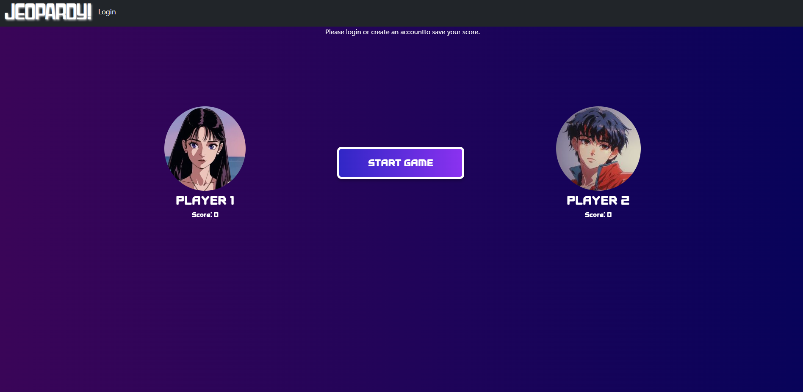
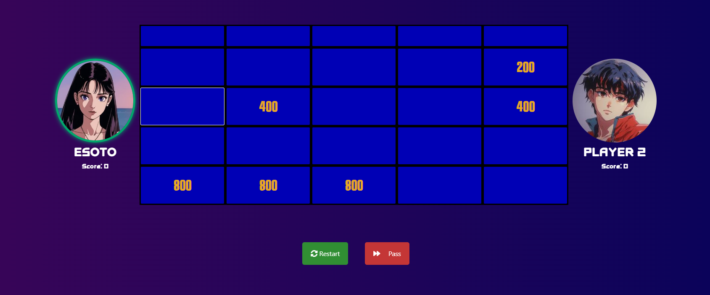
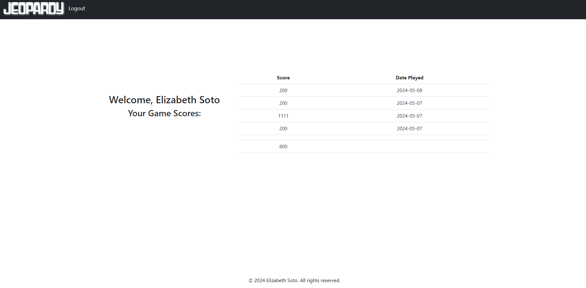

# Jeopardy Game

This is a simple web-based Jeopardy game where players can test their knowledge across various categories. This application was created as part of my final project for the graduate course Web Application Development (CS-412), where this course served as an inroduction to different techniques 
and tools for the design of web applications. Topics covered include web applications flow, object oriented programming,
design of classes, dynamic content, scripting languages, implicit objects, and database accessing. Where we were expected to understand and apply these concepts into the generation of sample websites.

The web application was deployed on the NEIU (Northeastern Illinois University) server. During deployment, all files were organized in a simple and accessible manner, without separating them into different folders. 
This means that all the files required for the web application to run were placed in the same directory or location without any further organization. The reason for this approach might have been to streamline the deployment process and make it easier to access and manage the files. By keeping all files in one place, it simplifies navigation and reduces the complexity of the project structure, especially during initial development and deployment phases.
However, I hope to reorganize the project files in the near future.

## Features

- Multiple categories including History, Art, Geography, Science, and Math.
- Two-player mode with score tracking.
- Timer for each question.
- Responsive design for different screen sizes.
- Option to pass on questions.
- Option to restart game sessions.
- Randomized question order for replayability.
- End-of-game result announcement.
- Final score for player 1(logged in user) are submitted to the database.
- Log In/ Create Account functionality.
- Profile page for logged in users to view scores.

## Installation

To run the game locally, follow these steps:

1. Clone this repository to your local machine.
2. Navigate to the project directory.
3. Open the `index.html` file in your web browser.

## Usage

- Click on "Start Game" to begin.
- Select a question by clicking on its value on the game board.
- Answer the question within the time limit.
- Score points for correct answers and track your progress.
- Pass on questions if unsure.
- The game will announce the winner at the end based on the scores.

## Contributing

Contributions are welcome! If you'd like to contribute to this project, please fork the repository, make your changes, and submit a pull request.

## License

This project is licensed under the MIT License. See the [LICENSE](LICENSE) file for details.

## Screenshots

## Acknowledgements

- Icons from [Font Awesome](https://fontawesome.com/).
- Styling inspired by Bootstrap.
